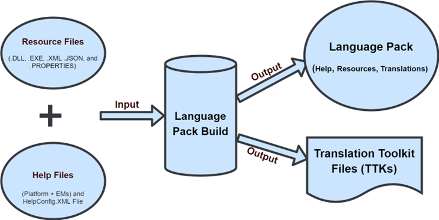
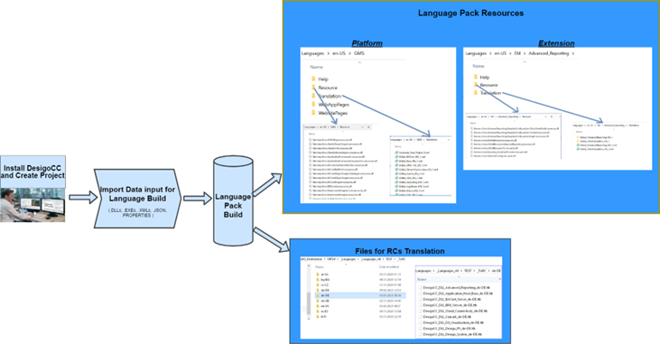
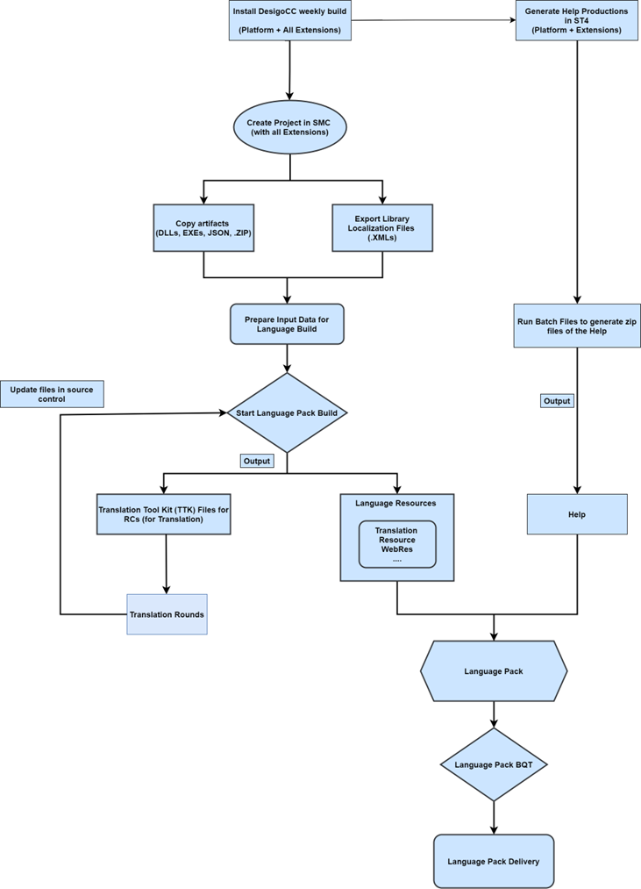

---
questions:
    - What is the purpose of the language pack process and workflow?
    - What are the main stages in the Desigo CC Language Resources Workflow?
    - How do resource strings and help files flow through the language pack process?
    - What platforms and extensions does the language pack workflow support?
    - What are the key differences between the overview, resources workflow, and language pack workflow diagrams?
---

# Language Pack Process and Workflow

The language pack process supports the localization of resource strings and help files for the Desigo CC platform and its extensions.

## Overview

_Figure: Overview_

## Desigo CC Language Resources Workflow for Language Build

_Figure: Desigo CC Language Resources Workflow for Language Build_

## Language Pack Workflow

_Figure: Language Pack Workflow_

---

_Restricted — © Siemens AG 2025_  
Page  of
