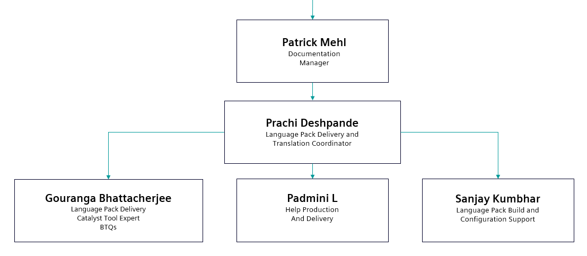

---
questions:
    - Who are the members of the Language Pack and Translation Management team?
    - What are the key roles within the team structure?
    - What are the main responsibilities of each team member?
    - How is the team organized for managing language packs and translations?
    - Who is responsible for different aspects of the localization process?
---

# Roles and Responsibilities
This section introduces the members of the Language Pack and Translation Management team with their roles and responsibilities.

## Team Structure
