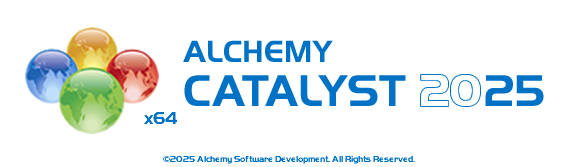
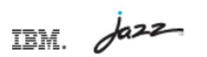
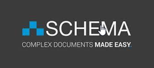

---
questions:
    - What is Alchemy Catalyst 2021 used for?
    - What role does RTC Jazz play in the language pack process?
    - What is Schema ST4 (Quanos) and what are its main functions?
    - What tool is used for Help file translations?
    - What are the key responsibilities of each tool in the translation workflow?
    - Why are these specific tools chosen for the localization process?
---

## Tools used by the Translation Management & Language Pack teams

- **Alchemy Catalyst 2021** — For resource translations  
    

- **RTC Jazz** — For language pack builds  
    

- **Schema ST4 (Quanos)** — For help production, versioning, and translation workflow  
    

- **Trados** — For help translations  
    